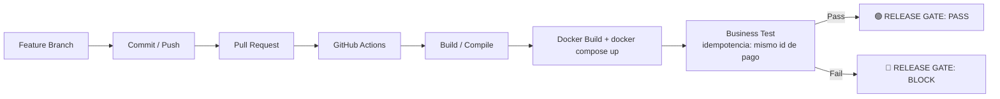

# Deber 1 — El falso verde: Release Gate para BankPulse

USFQ · Desarrollo de Software Moderno

## 1. Capacidad de negocio seleccionada

**BANKPULSE — Procesar un pago una sola vez.**

`payments-api` expone `POST /api/payments` protegido por el header
`X-Idempotency-Key`. La promesa de negocio es: **para una misma
`X-Idempotency-Key`, el cliente nunca debe ser cobrado dos veces**,
sin importar cuántas veces reintente la solicitud (timeout de red,
reintento automático del cliente, doble clic, etc.).

## 2. Escenario de "falso verde"

Si la verificación de idempotencia se rompe (por ejemplo, si
`PaymentService.create` deja de consultar `findByIdempotencyKey` antes
de persistir), ocurre lo siguiente:

- `GET /health/payments`, `GET /health/audit` → `200 OK`.
- Los cinco contenedores (`payments-api`, `audit-api`, `mariadb`,
  `mongo`, `console`) siguen `Up (healthy)`.
- `POST /api/payments` responde `200 OK` en ambos intentos.
- **Pero**: se crean **dos registros de pago distintos** (dos `id`)
  para la misma `X-Idempotency-Key`, y se publican dos eventos
  `PAYMENT_CREATED` en la auditoría en lugar de uno.

Infraestructura: 🟢 UP. Negocio: 🔴 pago duplicado. Un "¿está todo
funcionando?" técnico respondería "sí" — y ese "sí" es el problema que
describe el enunciado del deber.

## 3. Riesgo / pérdida potencial

- Cobro duplicado a un cliente real (pérdida financiera directa y
  reclamo).
- Descuadre entre `payments` (MariaDB) y los eventos de auditoría
  (MongoDB): dos eventos `PAYMENT_CREATED` para un solo pago percibido
  por el cliente.
- Pérdida de confianza: los health checks y el pipeline "estaban en
  verde" mientras el negocio perdía dinero.

## 4. Release Gate — diagrama



El gate vive en `.github/workflows/ci.yml` (job `integration-test`) y
se ejecuta en cada Pull Request y en cada push a `main`. El paso
`Business Test — Release Gate` (`scripts/smoke.sh`) crea un pago,
reintenta la **misma** solicitud con la **misma** `X-Idempotency-Key`,
y exige que ambas respuestas devuelvan el mismo `id` de pago; si no,
el job termina en `exit 1` y el PR queda bloqueado aunque los
contenedores sigan saludables.

## 5. PR exitoso 🟢

- **PR #1 — [feat(release-gate): formalizar Release Gate + docs/deber-01.md](https://github.com/demianc14/bankpulse-deber-01-falso-verde/pull/1)**
  (mergeado a `main` en el commit `2b9a2e1`).
- Refuerza el Release Gate en `ci.yml` (pasos `Business Test - Release
  Gate` y `Release Gate PASS`) y agrega este documento.
- Ejecución de `BankPulse CI` sobre el PR:
  [run #4 — 1m 23s, ✅](https://github.com/demianc14/bankpulse-deber-01-falso-verde/actions/runs/35175408606) —
  build de la stack real, Business Test en verde, `RELEASE GATE: PASS`.

## 6. PR con tecnología 🟢 y comportamiento de negocio 🔴

- **PR #2 — [feat(payments): agregar traza de correlacion al procesar un pago](https://github.com/demianc14/bankpulse-deber-01-falso-verde/pull/2)**
  (mergeado a `main` en el commit `feb966b`, luego de la corrección).
- Commit que provoca el falso verde:
  [`5b8ecd5`](https://github.com/demianc14/bankpulse-deber-01-falso-verde/commit/5b8ecd5) —
  se agrega un sufijo de correlación a la `Idempotency-Key` efectiva
  usada para buscar/guardar el pago (pensado "solo" para trazabilidad
  en logs).
- Ejecución de `BankPulse CI` sobre ese commit:
  [run #6 — Failure, 1m 36s](https://github.com/demianc14/bankpulse-deber-01-falso-verde/actions/runs/35175625527).
- `docker compose ps` en esa misma ejecución — los 5 servicios siguen
  healthy (infraestructura 🟢):

  ```
  bankpulse-platform-lab-audit-api-1      Up 17 seconds (healthy)
  bankpulse-platform-lab-console-1        Up 1 second
  bankpulse-platform-lab-mariadb-1        Up 23 seconds (healthy)
  bankpulse-platform-lab-mongo-1          Up 23 seconds (healthy)
  bankpulse-platform-lab-payments-api-1   Up 11 seconds (healthy)
  ```

## 7. Evidencia del bloqueo

Log del paso `Business Test - Release Gate` en el
[run #6](https://github.com/demianc14/bankpulse-deber-01-falso-verde/actions/runs/35175625527):

```
[3/4] Reintentando la misma solicitud (business test: no debe duplicarse el pago)
  payment id (request #1): 16d3dd13-c15c-43d9-a0eb-e8c0526ede7d
  payment id (request #2): b2a515af-0966-40ce-b382-5a97f09d4150
BUSINESS TEST FAILED: la misma Idempotency-Key produjo dos pagos distintos (posible cobro duplicado).
Error: Process completed with exit code 1.
```

Y el paso `Capture evidence on failure` del mismo run confirma el
"falso verde": infraestructura arriba, negocio roto —

```
RELEASE GATE: BLOCK. Tecnologia sigue UP, pero el business test detecto una perdida de negocio (falso verde).
```

seguido de la salida de `docker compose ps` citada en la sección 6
(los 5 contenedores healthy en la misma ejecución que bloqueó el PR).

## 8. Diagnóstico y corrección

**Diagnóstico:** `PaymentService.create()` construía una
`traceKey = idempotencyKey + "-" + UUID.randomUUID()` y usaba esa
clave (no la `Idempotency-Key` original del cliente) tanto para buscar
el pago existente (`findByIdempotencyKey`) como para persistir uno
nuevo. Como el sufijo aleatorio cambia en cada llamada, el segundo
request con la **misma** `Idempotency-Key` del cliente nunca
encontraba el pago creado por el primero, y `persist()` insertaba un
segundo registro válido — dos `id` de pago y dos eventos
`PAYMENT_CREATED` para una sola intención de pago del cliente.

**Corrección:**
[`2d45a84` — fix(payments): no mutar la Idempotency-Key al agregar traza de correlacion](https://github.com/demianc14/bankpulse-deber-01-falso-verde/commit/2d45a84).
La `Idempotency-Key` del cliente se usa sin modificar para buscar y
guardar el pago; el identificador de traza se sigue generando, pero
solo se usa en un `log.info(...)` y ya no participa de la clave de
negocio.

## 9. Ejecución final 🟢

Ejecución de `BankPulse CI` sobre el commit de corrección, en el mismo
PR #2:
[run #7 — 1m 35s, ✅](https://github.com/demianc14/bankpulse-deber-01-falso-verde/actions/runs/35175797618).
El Business Test vuelve a pasar (mismo `id` de pago en ambas
respuestas), `RELEASE GATE: PASS`, y el PR #2 se mergeó a `main` en el
commit
[`feb966b`](https://github.com/demianc14/bankpulse-deber-01-falso-verde/commit/feb966b).

## Reproducir desde un Codespace limpio

1. `Code → Codespaces → Create codespace on main`.
2. `cp .env.example .env`
3. `docker compose up --build -d && docker compose ps`
4. `bash scripts/smoke.sh` (o revisar el job `BankPulse CI` en la
   pestaña Actions del PR correspondiente).
