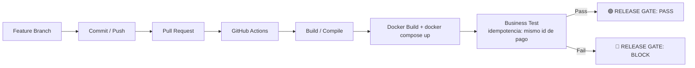

# Deber 1 — El falso verde: Release Gate para BankPulse

USFQ · Desarrollo de Software Moderno

## 1. Capacidad de negocio seleccionada

**BANKPULSE — Procesar un pago una sola vez.**

`payments-api` expone `POST /api/payments` protegido por el header
`X-Idempotency-Key`. La promesa de negocio es: **para una misma
`X-Idempotency-Key`, el cliente nunca debe ser cobrado dos veces**,
sin importar cuántas veces reintente la solicitud (timeout de red,
reintento automático del cliente, doble clic, etc.).

## 2. Escenario de "falso verde"

Si la verificación de idempotencia se rompe (por ejemplo, si
`PaymentService.create` deja de consultar `findByIdempotencyKey` antes
de persistir), ocurre lo siguiente:

- `GET /health/payments`, `GET /health/audit` → `200 OK`.
- Los cinco contenedores (`payments-api`, `audit-api`, `mariadb`,
  `mongo`, `console`) siguen `Up (healthy)`.
- `POST /api/payments` responde `200 OK` en ambos intentos.
- **Pero**: se crean **dos registros de pago distintos** (dos `id`)
  para la misma `X-Idempotency-Key`, y se publican dos eventos
  `PAYMENT_CREATED` en la auditoría en lugar de uno.

Infraestructura: 🟢 UP. Negocio: 🔴 pago duplicado. Un "¿está todo
funcionando?" técnico respondería "sí" — y ese "sí" es el problema que
describe el enunciado del deber.

## 3. Riesgo / pérdida potencial

- Cobro duplicado a un cliente real (pérdida financiera directa y
  reclamo).
- Descuadre entre `payments` (MariaDB) y los eventos de auditoría
  (MongoDB): dos eventos `PAYMENT_CREATED` para un solo pago percibido
  por el cliente.
- Pérdida de confianza: los health checks y el pipeline "estaban en
  verde" mientras el negocio perdía dinero.

## 4. Release Gate — diagrama

El gate vive en `.github/workflows/ci.yml` (job `integration-test`) y
se ejecuta en cada Pull Request y en cada push a `main`. El paso
`Business Test — Release Gate` (`scripts/smoke.sh`) crea un pago,
reintenta la **misma** solicitud con la **misma** `X-Idempotency-Key`,
y exige que ambas respuestas devuelvan el mismo `id` de pago; si no,
el job termina en `exit 1` y el PR queda bloqueado aunque los
contenedores sigan saludables.

## 5. PR exitoso 🟢

- PR: *(se agrega el enlace al mergear)* — refuerza el Release Gate
  (`ci.yml` con pasos `Release Gate PASS` / bloqueo explícito) y agrega
  este documento.
- Evidencia: ejecución de `BankPulse CI` en verde sobre el PR.

## 6. PR con tecnología 🟢 y comportamiento de negocio 🔴

- PR: *(se agrega el enlace)* — rompe intencionalmente la
  verificación de idempotencia en `PaymentService`.
- `docker compose ps` de esa ejecución: los 5 servicios siguen
  `healthy`.
- El paso `Business Test — Release Gate` falla: dos `id` de pago
  distintos para la misma `X-Idempotency-Key`.

## 7. Evidencia del bloqueo

*(captura del log de Actions con el job en rojo y el mensaje
`RELEASE GATE: BLOCK`, y captura de `docker compose ps` mostrando los
contenedores healthy en la misma ejecución — se agregan al mergear el
PR de corrección)*

## 8. Diagnóstico y corrección

*(se documenta la causa exacta del "falso verde" introducido y el
commit de corrección)*

## 9. Ejecución final 🟢

*(enlace a la ejecución de `BankPulse CI` posterior a la corrección,
en verde, sobre la misma rama)*

## Reproducir desde un Codespace limpio

1. `Code → Codespaces → Create codespace on main`.
2. `cp .env.example .env`
3. `docker compose up --build -d && docker compose ps`
4. `bash scripts/smoke.sh` (o revisar el job `BankPulse CI` en la
   pestaña Actions del PR correspondiente).
